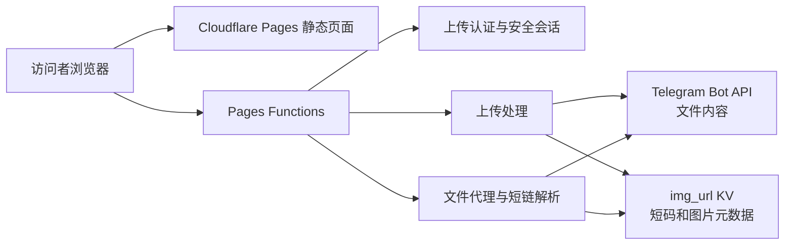

# 用 Cloudflare Pages 和 Telegram 搭建带访问保护与短链的个人图床：T-IMG

## 前言

日常写博客、维护文档或在论坛分享内容时，一个稳定、方便复制链接的图片托管工具非常实用。但如果上传入口完全公开，任何人都可以直接消耗项目的 Telegram、Cloudflare Functions 和 KV 配额；如果只在前端隐藏上传区域，又很容易被直接调用上传接口绕过。

T-IMG 是我围绕这一问题整理和持续维护的个人文件托管项目。它使用 Cloudflare Pages 托管静态页面，由 Pages Functions 处理认证、上传、短链解析和管理 API，文件内容交给 Telegram 保存，Cloudflare Workers KV 则负责短码映射与图片元数据。

项目地址：

- GitHub：<https://github.com/LuoPoJunZi/T-IMG>
- 在线部署：<https://t-img-1pk.pages.dev/>（上传入口需要站点所有者配置的访问密码）
- 本文对应版本：当前 `main` 工作区的 Unreleased 版本

T-IMG 的目标不是把所有组件都堆进项目，而是在尽量少的运行依赖和云资源下，解决上传安全、公开访问、链接长度、后台管理和长期维护这几个核心问题。

## 项目能做什么

目前 T-IMG 提供以下能力：

- 将图片、音频、视频、PDF、压缩包和普通文件上传至 Telegram。
- 使用 Pages 同域地址访问文件，避免把 Telegram Bot Token 暴露给浏览器。
- 上传页面必须先通过后端密码验证，不能仅靠前端 JavaScript 绕过。
- 上传接口再次检查会话，未认证用户无法直接调用 `POST /upload`。
- 使用安全 Cookie 保持登录状态，并提供主动退出功能。
- 错误密码始终由后端拒绝，不保存密码或错误次数。
- 为新上传自动生成 `/i/短码.扩展名` 形式的短链。
- 使用一个 `img_url` KV 同时保存短码映射、文件元数据和管理状态。
- 提供基础管理页、画廊、瀑布流、黑名单、白名单、收藏和显示名称修改。
- 保留已有 `/file/:id` 链接和旧管理路由的兼容性。
- 使用 Node.js 内置测试与 Wrangler 本地 Pages 环境做自动化回归。

公开图片链接不需要登录。上传访问保护只限制上传页面和上传接口，不会把已经发布的图片变成私有文件，也不会破坏后台原有的认证逻辑。

## 整体架构

T-IMG 没有传统服务器，也没有单独部署数据库。主要数据流如下：



各部分职责比较清晰：

| 组件 | 职责 |
|---|---|
| Cloudflare Pages | 托管上传页、登录页和管理页面等静态资源 |
| Pages Functions | 执行后端认证、上传、文件代理、短链解析和管理 API |
| Telegram Bot API | 接收并保存实际文件内容 |
| `img_url` KV | 保存短码映射、Telegram 文件标识和管理元数据 |
| 浏览器安全 Cookie | 保存经过后端签名的上传会话，不保存真实密码 |

## 仓库结构

项目仍是以静态页面为主的 Pages 项目，没有引入新的前端框架构建流程：

```text
T-IMG/
├─ index.html                    # 主上传页面
├─ markdown-upload.html          # Markdown 上传页面
├─ upload-login.html             # 上传访问验证页面
├─ admin.html                    # 基础管理页
├─ admin-gallery.html            # 画廊管理页
├─ admin-waterfall.html          # 瀑布流页面
├─ assets/                       # 图片、图标、样式和浏览器脚本
├─ functions/
│  ├─ _middleware.js             # 上传页面后端保护
│  ├─ upload.js                  # POST /upload
│  ├─ i/[id].js                  # /i/:short-code.ext
│  ├─ file/[id].js               # /file/:id 兼容文件入口
│  ├─ api/upload-auth/           # 登录、会话状态和退出
│  ├─ api/manage/                # 管理 API
│  └─ utils/                     # 上传、认证和代理公共逻辑
├─ test/                         # Node.js 自动化测试
├─ docs/                         # 需求、决策、部署与工作记录
├─ _routes.json                  # 必须经过 Functions 的路由
└─ _redirects                    # 旧静态地址兼容重定向
```

其中 `_routes.json` 很关键。上传页、登录页、上传接口、管理 API、`/file/*` 和 `/i/*` 必须进入 Functions。如果生产环境允许 Functions 配额耗尽后回退到静态文件，就可能绕开上传页保护，因此生产环境应使用 Fail closed。

## 为什么上传保护必须由后端完成

只用 CSS 隐藏上传区域、在 JavaScript 中比较密码，或者向 `localStorage` 写入“已验证”标记，都不能真正阻止未授权上传。攻击者可以查看前端代码、修改浏览器状态，甚至跳过页面直接构造 HTTP 请求。

T-IMG 的认证流程是：

1. 用户访问 `/`、`/index.html`、`/markdown-upload.html` 或对应的 Pages Clean URL。
2. 根级 Pages Function 检查上传会话 Cookie。
3. 没有有效会话时，后端返回 302 并跳转到 `/upload-login`。
4. 用户提交访问密码后，登录 API 在后端读取 `UPLOAD_ACCESS_PASSWORD` 并进行比较。
5. 密码正确时，后端创建包含签发时间、过期时间和随机数的会话数据。
6. 会话使用 `UPLOAD_SESSION_SECRET` 和 HMAC-SHA256 签名。
7. 浏览器收到 `__Host-` 前缀的安全 Cookie，在有效期内刷新页面无需重新输入密码。
8. `POST /upload` 还会再次验证会话，防止绕过页面直接上传。
9. 用户退出时，后端通过过期 Cookie 清除会话。

会话 Cookie 使用以下约束：

- `HttpOnly`：浏览器 JavaScript 无法读取。
- `Secure`：只通过 HTTPS 发送。
- `SameSite=Strict`：降低跨站请求携带 Cookie 的风险。
- `Path=/`：覆盖站点需要验证的路由。
- `__Host-` 前缀：禁止设置 `Domain`，并要求安全属性。

上传登录和上传接口还会检查浏览器请求来源，拒绝不符合要求的跨站请求。真实密码不会被写进 HTML、CSS、前端 JavaScript、Cookie 或 Git 仓库。

## 错误密码与强密码策略

T-IMG 采用适合个人站点的简化认证模型：每次密码都由后端校验，错误时统一返回 401，不创建会话，不记录用户输入的密码，也不保存错误次数。因此上传认证不需要 `UPLOAD_AUTH_KV`，唯一必需的 KV 仍是保存图片索引的 `img_url`。

这个取舍减少了一个 KV Namespace、登录读写和部署步骤，但也意味着项目本身不提供递增等待或暴力破解限流。生产环境不要使用能被字典猜中的密码，应使用密码管理器或系统密码学安全随机源生成至少 24 个随机字符。错误尝试虽然不会消耗 KV 读写，仍会产生 Pages Functions 请求。

如果站点公开范围较大或出现异常攻击流量，可以在自定义域名上叠加 Cloudflare WAF、Rate Limiting、Turnstile 或 Access。它们属于边缘增强措施，不改变 T-IMG 现有的后端密码、签名 Cookie 和上传接口二次校验。

## 上传链路如何工作

通过认证后，前端继续使用原有的拖拽、选择文件、上传进度和结果展示流程。后端收到 `POST /upload` 后依次执行：

1. 验证上传会话或合法的后台 Basic Auth。
2. 检查是否为允许的同源浏览器请求。
3. 检查 `TG_Bot_Token`、`TG_Chat_ID` 和 `img_url` KV 绑定。
4. 解析 `multipart/form-data` 并取得名为 `file` 的上传内容。
5. 拒绝空文件和超过限制的文件。
6. 清理文件名，生成安全扩展名。
7. 根据 MIME 类型选择 Telegram 的 `sendPhoto`、`sendAudio`、`sendVideo` 或 `sendDocument`。
8. 图片发送方式被 Telegram 拒绝时，自动退回文档发送方式。
9. 网络错误最多重试两次，但不会向客户端暴露 Telegram 的内部错误描述。
10. 提取 Telegram 返回的 `file_id`，生成短码并写入 `img_url`。
11. 返回保持兼容的 JSON 数组，例如：

```json
[
  {
    "src": "/i/AbCdEf0123_-.png"
  }
]
```

默认上传上限是 20 MiB。项目允许使用 `MAX_UPLOAD_SIZE_BYTES` 把上限调低，但不会把它提高到默认值以上，这样可以保证上传内容仍能通过项目当前使用的 Telegram 公共 Bot API 下载链路取回。

## 自动短链的设计

Telegram `file_id` 通常很长，直接放进公开链接虽然简单，但不适合经常复制到博客或聊天窗口。T-IMG 为新上传生成 12 位 Base64URL 短码，最终地址类似：

```text
https://example.com/i/AbCdEf0123_-.png
```

短码来自 9 字节随机数据，总随机空间为 72 位，并且只包含 URL 安全字符。短码完全由后端生成，不支持用户自定义命名，避免名称抢占、敏感词、路径注入和额外权限判断。

项目没有再创建一个 `IMAGE_ALIAS_KV`，而是复用现有 `img_url`。一条示例记录可以理解为：

```text
KV key: AbCdEf0123_-.png
```

```json
{
  "telegramFileId": "TELEGRAM_FILE_ID_PLACEHOLDER",
  "TimeStamp": 1784563200000,
  "ListType": "None",
  "Label": "None",
  "liked": false,
  "fileName": "example.png",
  "fileSize": 102400
}
```

访问 `/i/AbCdEf0123_-.png` 时，Function 通过一次 `getWithMetadata()` 同时拿到完整 Telegram 文件标识和黑白名单等管理状态，不需要先查别名 KV、再查图片 KV。已有元数据没有变化时也不会在每次访问后重复执行 `put()`。

生成短码时没有增加一次“查询是否碰撞”的 KV 读取。原因是 72 位随机空间已经把正常规模下的碰撞概率降得很低，而 KV 的最终一致性也不适合用“先读取、再写入”实现严格的全局唯一约束。

如果 Telegram 已经接收文件，但写入短码 KV 时发生瞬时故障，接口不会返回一个打不开的短链，也不会提示用户重新上传。它会退回旧式长地址：

```text
/file/{telegram_file_id}.{extension}
```

这个地址可以直接通过 Telegram `file_id` 解析，避免重复上传和孤立文件。

## 文件访问与兼容策略

新短链和旧文件入口共用同一套安全代理逻辑：

- `/i/:short-code.ext`：必须读取 `img_url` 短码记录，随后查询 Telegram 文件路径。
- `/file/:id`：继续兼容历史 Telegram 地址和 Telegraph 地址。
- 后台原有的 `/file/短码` 预览方式也可以识别新记录中的 `telegramFileId`。

代理只向外部服务转发 `Accept`、`Range` 和必要的条件请求头，不会把站点 Cookie 或后台 Authorization Header 发送给 Telegram、Telegraph 或其他服务。

公开访问时，Function 会读取管理元数据并依次处理白名单、黑名单、成人标签和全局白名单模式。`img_url` 临时不可用时，可直接解析的旧 `/file/` 地址仍尽量保持可用；短链因为无法取得映射，会返回不泄露内部信息的 503。

需要注意：从 KV 删除记录只会删除短码和管理元数据，不会自动删除 Telegram 中已经发送的文件。

## Cloudflare 配置清单

生产环境的值应在 Cloudflare Pages 控制台中配置，不要把真实值提交到代码仓库。

| 名称 | 是否必需 | Cloudflare 类型 | 说明 |
|---|---|---|---|
| `TG_Bot_Token` | 必需 | Secret | Telegram Bot Token |
| `TG_Chat_ID` | 必需 | Text | 目标频道或群组 ID |
| `MAX_UPLOAD_SIZE_BYTES` | 可选 | Text | 上传字节上限，只能低于或等于 20 MiB |
| `UPLOAD_ACCESS_PASSWORD` | 必需 | Secret | 代码最低 12 字符；生产建议至少 24 个随机字符 |
| `UPLOAD_SESSION_SECRET` | 必需 | Secret | 后端会话签名密钥，至少 32 字符且不能与访问密码相同 |
| `UPLOAD_SESSION_MAX_AGE` | 可选 | Text | 会话秒数，默认 604800，即 7 天 |
| `img_url` | 必需 | KV Namespace binding | 短码、图片元数据和后台管理数据 |
| `BASIC_USER` | 建议 | Text | 后台 Basic Auth 用户名 |
| `BASIC_PASS` | 建议 | Secret | 后台 Basic Auth 密码 |
| `ModerateContentApiKey` | 可选 | Secret | 旧 Telegraph 图片内容审核 |
| `WhiteList_Mode` | 可选 | Text | 严格设置为 `true` 时启用白名单模式 |

这里最容易配置错误的是 KV：`img_url` 是唯一必需的 KV，必须在 Bindings 中添加为 KV Namespace，不能在 Variables and Secrets 中添加成普通文本或 Secret。上传认证的密码和会话密钥则必须添加为 Secret。

## 从零部署到 Cloudflare Pages

下面按照第一次部署时的真实先后顺序说明。整个过程不需要购买服务器，也不需要在本地执行前端构建；需要准备 GitHub、Cloudflare 和 Telegram 三个平台的账号。

### 部署前准备

先准备以下内容，但不要把真实值写进笔记截图、Git 提交、Issue 或聊天记录：

| 项目 | 用途 | 何时获得 |
|---|---|---|
| 自己控制的 GitHub 仓库 | 让 Cloudflare 自动拉取并部署代码 | 第 1 步 |
| Telegram Bot Token | 让 Pages Function 以 Bot 身份发送和读取文件 | 第 2 步 |
| Telegram Chat ID | 指定保存文件的频道或群组 | 第 3 步 |
| 上传访问密码 | 访问者进入上传页时输入 | 第 7 步 |
| 会话签名密钥 | 后端签名登录 Cookie，访问者不会看到 | 第 7 步 |
| 一个 Cloudflare KV Namespace | 保存图片索引、短码和管理元数据 | 第 4 步 |

为减少配置错误，建议先在密码管理器中建立一条 T-IMG 记录，只保存值，不要把值写进仓库。Cloudflare 变量名区分大小写，后文出现的名称必须原样填写。

### 第 1 步：准备自己的 GitHub 仓库

如果直接使用本文项目，可以先把 T-IMG 代码放到自己控制的独立仓库。仓库必须至少有一个已经推送的 `main` 分支，否则 Cloudflare 创建项目时无法选择生产分支。

本地已有 Git 和 Node.js 时，可以使用下面的方式复制代码。将 `<YOUR_GITHUB_NAME>` 替换为自己的 GitHub 用户名；目标仓库应事先在 GitHub 创建并保持为空：

```bash
git clone https://github.com/LuoPoJunZi/T-IMG.git
cd T-IMG
git remote remove origin
git remote add origin https://github.com/<YOUR_GITHUB_NAME>/T-IMG.git
git push -u origin main
```

也可以直接让 Cloudflare 读取有权限访问的 T-IMG 仓库。无论采用哪种方式，都要确认仓库根目录仍包含以下内容：

```text
functions/
index.html
upload-login.html
_routes.json
_redirects
```

不要只上传 HTML 文件。缺少 `functions/` 时，上传认证、上传接口、短链和管理 API 都不会部署；缺少 `_routes.json` 时，安全路由和 Functions 调用范围可能与项目预期不一致。

### 第 2 步：创建 Telegram Bot

1. 在 Telegram 中打开官方 [@BotFather](https://t.me/BotFather)。仔细核对账号用户名，避免把 Token 交给仿冒账号。
2. 发送 `/newbot`。
3. 按提示输入 Bot 显示名称。
4. 再输入一个以 `bot` 结尾且尚未被占用的用户名。
5. BotFather 会返回一段 Bot Token。把它保存到密码管理器，后续作为 `TG_Bot_Token` 使用。

Bot Token 相当于这个 Bot 的完整控制凭据。不要把它粘贴到网页源码、前端 JavaScript、GitHub Actions 日志或公开截图中。如果 Token 曾经泄露，应立即在 BotFather 中撤销并生成新 Token，然后更新 Cloudflare Secret。

### 第 3 步：创建 Telegram 频道并取得 Chat ID

#### 3.1 创建用于存储文件的频道

推荐单独创建一个私有 Telegram Channel，不要与日常聊天群混用：

1. 在 Telegram 中新建频道。
2. 打开频道设置，进入管理员列表。
3. 添加刚创建的 Bot 为管理员。
4. 至少授予发送或发布消息所需的权限。
5. 添加完成后，在频道中发送一条新的测试消息。

如果使用群组，Bot 同样必须能向该群发送文件。频道或群组改名通常不会改变数字 Chat ID，因此生产环境更推荐数字 ID。

#### 3.2 获取 Chat ID

公开频道可以尝试把 `@频道用户名` 直接作为 `TG_Chat_ID`；Telegram Bot API 接受数字 ID，也接受 `@channelusername` 形式的公开频道用户名。私有频道没有公开用户名时，应使用数字 ID，通常形如 `-100...`。

为了避免把频道信息交给第三方查询 Bot，可以使用 Telegram 官方 Bot API 获取数字 ID。先在 Windows PowerShell 中运行：

```powershell
$telegramTokenSecure = Read-Host "请输入 Bot Token" -AsSecureString
$telegramToken = [Net.NetworkCredential]::new("", $telegramTokenSecure).Password
$telegramUpdates = Invoke-RestMethod -Method Get -Uri ("https://api.telegram.org/bot{0}/getUpdates" -f $telegramToken)
$telegramUpdates.result | ConvertTo-Json -Depth 20
Remove-Variable telegramToken, telegramTokenSecure, telegramUpdates
```

在返回结果中查找以下任一位置：

```text
channel_post.chat.id
message.chat.id
```

看到的负数 ID 就是 `TG_Chat_ID`。如果结果数组为空：

1. 确认 Bot 已经加入频道并成为管理员。
2. 在 Bot 加入后重新向频道发送一条消息。
3. 再运行一次命令。
4. 如果这个 Bot 以前配置过 webhook，`getUpdates` 可能无法同时使用；先用官方 `getWebhookInfo` 检查。不要在不了解影响时删除正在被其他系统使用的 webhook，最稳妥的方式是为 T-IMG 新建专用 Bot。

不要把包含 Token 的完整 API 地址直接粘贴进浏览器地址栏，因为它可能被保存在历史记录、同步记录或代理日志中。上面的命令通过交互方式读取 Token，不会把真实值写进脚本文件。

### 第 4 步：创建图片元数据 KV Namespace

进入 Cloudflare Dashboard 的 Workers KV 管理页面。不同版本控制台可能显示为 `Storage & Databases > KV`，也可能从 `Workers & Pages` 的存储入口进入。创建一个 Namespace：

| KV 资源显示名称示例 | 后续绑定变量名 | 保存内容 |
|---|---|---|
| `t-img-images` | `img_url` | 短码、Telegram 文件标识、文件名、黑白名单和后台元数据 |

这里必须区分两个概念：

- **KV 资源显示名称**只用于你在 Cloudflare 控制台中识别资源，可以自行修改。
- **绑定变量名**是 Functions 代码访问资源时使用的名字，必须严格填写为 `img_url`。

短链直接复用 `img_url`，不需要创建 `IMAGE_ALIAS_KV`、`UPLOAD_AUTH_KV` 或其他额外 KV。

### 第 5 步：在 Cloudflare Pages 连接 GitHub

1. 登录 Cloudflare Dashboard。
2. 进入 `Workers & Pages`。
3. 选择 `Create application > Pages > Connect to Git`。中文界面可能显示为“创建应用程序 > Pages > 连接到 Git”。
4. 选择 GitHub 并授权 Cloudflare。建议只授权需要部署的仓库。
5. 选中自己的 `T-IMG` 仓库，点击开始设置。
6. 项目名称可填写 `t-img` 或其他未被占用的名称。这个名称通常会影响默认的 `*.pages.dev` 地址。
7. 生产分支选择 `main`。

构建设置按下面填写：

| 设置项 | T-IMG 的值 |
|---|---|
| Framework preset | `None` 或不选择框架 |
| Build command | 留空 |
| Build output directory | 仓库根目录；界面允许留空时保持留空，要求填写时使用 `.` |
| Root directory | 留空，使用仓库根目录 |

T-IMG 的 HTML、资源文件和 Functions 已经位于仓库根目录，不需要执行 `npm run build`。首次点击部署后，即使还没有配置 Telegram 和认证变量，静态资源和 Functions 也应能编译成功；但上传功能会安全地返回“配置未完成”，这是预期行为。

> 如果构建日志显示 `No build command specified. Skipping build step.`，并不是错误。真正需要确认的是后面出现 `Found Functions directory at /functions` 和 `Compiled Worker successfully`。

### 第 6 步：确认首次部署完整

打开刚才的部署详情，正常日志应包含与下面含义相同的内容：

```text
No build command specified. Skipping build step.
Found Functions directory at /functions. Uploading.
Compiled Worker successfully
Found _routes.json in output directory. Uploading.
Assets published
Your site was deployed
```

如果只看到静态文件发布而没有发现 `functions/`，优先检查：

1. Cloudflare 连接的是否是正确仓库和 `main` 分支。
2. Pages 的 Root directory 是否错误地指向了子目录。
3. Build output directory 是否没有指向仓库根目录。
4. GitHub 仓库中是否真的存在 `functions/` 和 `_routes.json`。

“部署成功”只说明代码编译和静态资源发布成功，不代表运行时变量、Secret 和 KV 已经配置完整。接下来仍必须完成第 7 至第 10 步。

### 第 7 步：添加 Production 变量与 Secret

进入：

```text
Workers & Pages > T-IMG > Settings > Variables and Secrets > Add
```

在 **Production** 环境逐项添加。中文界面中的“纯文本”对应普通 Text，“密钥”对应加密 Secret。

| 变量名 | 类型 | 填写内容 | 是否必需 |
|---|---|---|---|
| `TG_Bot_Token` | Secret / 密钥 | BotFather 返回的 Bot Token | 必需 |
| `TG_Chat_ID` | Text / 纯文本 | 数字 Chat ID 或公开频道 `@username` | 必需 |
| `UPLOAD_ACCESS_PASSWORD` | Secret / 密钥 | 访问者在上传登录页输入的密码 | 必需 |
| `UPLOAD_SESSION_SECRET` | Secret / 密钥 | 独立随机会话签名密钥 | 必需 |
| `UPLOAD_SESSION_MAX_AGE` | Text / 纯文本 | `604800`，即 7 天 | 可选 |
| `BASIC_USER` | Text / 纯文本 | 后台管理员用户名 | 强烈建议 |
| `BASIC_PASS` | Secret / 密钥 | 后台管理员密码 | 强烈建议 |
| `MAX_UPLOAD_SIZE_BYTES` | Text / 纯文本 | 例如 `20971520` | 可选 |

可选的 `ModerateContentApiKey` 应选择 Secret；`WhiteList_Mode` 选择 Text，只有值严格等于 `true` 时才启用白名单模式。

#### 7.1 设置上传访问密码

`UPLOAD_ACCESS_PASSWORD` 就是站点使用者真正需要输入的那一个密码。代码要求至少 12 个字符，但由于项目不保存错误次数，生产环境建议至少使用 24 个随机字符，并选择“密钥”保存。

不要把自己的姓名、生日、手机号、GitHub 密码或后台管理密码直接拿来复用。这个值只能由后端读取，不会出现在前端源码中。

可以在 Windows PowerShell 中运行以下命令生成 32 字符、192 位随机访问密码：

```powershell
$uploadPasswordBytes = New-Object byte[] 24
$uploadPasswordGenerator = [Security.Cryptography.RandomNumberGenerator]::Create()
$uploadPasswordGenerator.GetBytes($uploadPasswordBytes)
[Convert]::ToBase64String($uploadPasswordBytes)
$uploadPasswordGenerator.Dispose()
```

把输出保存到密码管理器，再粘贴到 `UPLOAD_ACCESS_PASSWORD` 的 Secret 值。不要把输出提交到 Git、复制到博客、发送到聊天或截图公开。

#### 7.2 生成会话签名密钥

`UPLOAD_SESSION_SECRET` 不是第二个登录密码，而是后端签名安全 Cookie 的内部密钥。访问者不需要知道它，也绝不能与 `UPLOAD_ACCESS_PASSWORD` 相同。

Windows PowerShell 可生成 48 字节随机值：

```powershell
$sessionSecretBytes = New-Object byte[] 48
$sessionSecretGenerator = [Security.Cryptography.RandomNumberGenerator]::Create()
$sessionSecretGenerator.GetBytes($sessionSecretBytes)
[Convert]::ToBase64String($sessionSecretBytes)
$sessionSecretGenerator.Dispose()
```

把输出复制到 `UPLOAD_SESSION_SECRET`，类型选择 Secret / 密钥。生成后关闭终端或清除滚动记录，不要把输出保存到 `.env.example`、README、截图或聊天中。以后修改此密钥会立即使所有已有上传会话失效。

#### 7.3 设置登录保持时间

`UPLOAD_SESSION_MAX_AGE=604800` 表示登录保持 7 天。还可以设置：

| 时长 | 秒数 |
|---|---:|
| 1 小时 | `3600` |
| 1 天 | `86400` |
| 7 天 | `604800` |
| 30 天 | `2592000` |

代码允许 300 秒到 30 天。值越长，使用更方便；值越短，凭据泄露后的会话暴露窗口越小。

### 第 8 步：绑定图片元数据 KV Namespace

进入：

```text
Workers & Pages > T-IMG > Settings > Bindings > Add > KV namespace
```

添加图片索引绑定：

```text
Variable name: img_url
KV namespace: 选择第 4 步创建的 t-img-images
```

保存前逐字核对大小写。`img_url` 中的 `img` 是小写。它必须是 KV Namespace binding，不能在 Variables and Secrets 中添加成普通文本或 Secret。

如果同时使用 Preview 部署，建议为 Preview 单独创建图片 KV，并在 Preview 环境中使用相同的 `img_url` 绑定变量名连接到测试 Namespace。Production 与 Preview 的变量、Secret 和绑定彼此独立；只配置 Preview 不会修复生产站点，只配置 Production 也不会自动让分支预览可用。

### 第 9 步：设置 Fail closed

进入：

```text
Workers & Pages > T-IMG > Settings > Runtime > Fail open / closed
```

选择 **Fail closed**。T-IMG 的上传页面依赖根级 Function 做后端会话检查；如果 Functions 因配额或平台错误无法执行，Fail closed 会返回错误页，而不是直接把静态上传页面交给未认证用户。

这项设置不影响 `/i/*` 和 `/file/*` 的正常公开访问逻辑；它只决定“本应执行 Function 但 Function 不可用”时，Cloudflare 是失败关闭还是绕过 Function 继续提供静态文件。

### 第 10 步：保存配置并重新部署

Cloudflare 对变量、Secret 和绑定的修改通常在下一次部署中生效。完成第 7 至第 9 步后：

1. 返回 Pages 项目的 `Deployments` 页面。
2. 找到最新 `main` 生产部署。
3. 选择 `Retry deployment` 或“重新部署”。
4. 等待状态变为成功。
5. 确认 Production 指向这次新部署，而不是旧的 Preview URL。

以后只要修改以下任一内容，都应创建一次新部署：

- Functions 或静态页面代码；
- Telegram 变量；
- 上传密码或会话密钥；
- KV 绑定；
- Pages Runtime 或兼容日期设置。

只修改本地 `.env`、`.env.example` 或密码管理器，不会改变 Cloudflare 线上环境。

### 第 11 步：第一次登录和上传

假设站点地址是 `https://<PROJECT>.pages.dev`：

1. 使用无痕窗口打开 `https://<PROJECT>.pages.dev/`。
2. 浏览器应被后端重定向到 `/upload-login`，而不是直接显示上传界面。
3. 输入一个错误密码，应提示验证失败。
4. 输入 `UPLOAD_ACCESS_PASSWORD` 的真实值，应进入原上传页面。
5. 选择一张小尺寸测试图片并上传。
6. 成功后应返回类似 `/i/AbCdEf0123_-.png` 的 12 位自动短链。
7. 复制完整地址到另一个未登录的无痕窗口，图片应可以公开访问。
8. 刷新已登录的上传页，应在会话有效期内保持登录。
9. 点击“退出上传”，再次打开根地址时应重新要求密码。

还可以在未登录终端中验证上传接口不能绕过页面：

```bash
curl -i -X POST https://<PROJECT>.pages.dev/upload
```

没有有效会话时应返回 401，而不是接受上传。这个测试不需要提供文件，也不会向 Telegram 发送内容。

### 第 12 步：验证管理后台

生产环境强烈建议同时配置 `BASIC_USER` 和 `BASIC_PASS`。然后分别打开：

```text
https://<PROJECT>.pages.dev/admin.html
https://<PROJECT>.pages.dev/admin-gallery.html
https://<PROJECT>.pages.dev/admin-waterfall.html
```

检查以下项目：

1. 未提供后台凭据时不能读取管理 API。
2. 登录后能看到刚上传的短码记录。
3. 图片预览、复制链接、收藏、黑名单和显示名称修改正常。
4. 删除记录前理解其语义：它只删除 KV 元数据，不会从 Telegram 频道中删除原文件。

如果选择 Cloudflare Access 代替 Basic Auth，应同时保护 `/admin*` 与 `/api/manage/*`，不能只保护静态管理页面。

### 第 13 步：绑定自定义域名并增加 WAF 人机验证

后端强密码可以阻止错误凭据进入上传页面，Cloudflare WAF Managed Challenge 则在请求到达 Pages Functions 前识别浏览器和自动化流量。两层防护解决的问题不同，建议面向公网的站点同时使用。

#### 13.1 绑定由 Cloudflare 代理的域名

建议使用 `img.example.com` 这类独立子域名。先把根域名加入 Cloudflare 并让区域状态变为 Active，然后进入：

```text
Workers & Pages > T-IMG > Custom domains > Set up a domain
```

添加 `img.example.com`。如果域名与 Pages 项目位于同一 Cloudflare 账户，Pages 通常会自动创建 CNAME。到 DNS 页面确认记录处于 **Proxied / 已代理（橙色云）**，等待 Pages 的域名和 HTTPS 证书状态变为 Active。

必须先在 Pages 中关联域名，再处理 DNS。只手工把 CNAME 指向 `<PROJECT>.pages.dev`、却没有完成 Pages Custom domains 流程，可能得到 522。

#### 13.2 关闭 `*.pages.dev` 旁路

WAF 规则属于自己的域名区域，不会自动覆盖 `<PROJECT>.pages.dev`。如果攻击者仍能直接打开默认域名，就可以绕过自定义域名上的人机验证。

在 Cloudflare Bulk Redirects 创建规则：

| 设置 | 示例 |
|---|---|
| Source URL | `<PROJECT>.pages.dev` |
| Target URL | `https://img.example.com` |
| Status | `301` |
| Preserve query string | 开启 |
| Subpath matching | 开启 |
| Preserve path suffix | 开启 |

需要把分支和哈希 Preview 也一起收口时再开启 Include subdomains；它会使 Preview 地址跳到生产域名。仍需使用 Preview 时，可改用 Cloudflare Access 保护预览环境。

#### 13.3 新建上传登录 Managed Challenge

进入域名区域：

新版控制台路径：

```text
example.com > 安全性（Security） > 安全规则（Security rules）
            > 创建规则（Create rule） > 自定义规则（Custom rules）
```

Cloudflare 正在逐步切换新版安全控制台。如果界面仍是旧版，对应路径为：

```text
example.com > Security > WAF > Custom rules > Create rule
```

规则名称可填写 `T-IMG upload login managed challenge`。在 Expression Editor 中粘贴：

```text
(http.host eq "img.example.com" and (
  http.request.uri.path in {"/upload-login" "/upload-login/" "/upload-login.html"}
  or (http.request.uri.path in {"/api/upload-auth/login" "/api/upload-auth/login/"}
      and http.request.method eq "POST")
))
```

把 `img.example.com` 替换成自己的主机名，动作选择 **Managed Challenge / 托管质询**，状态选择 **活动（Active）**，再点击 **部署（Deploy）**。“已禁用（Disabled）”只保存规则，不会对传入流量执行人机验证。启用后的规则会验证登录页面和直接提交密码的请求，但不会影响：

- `/i/*` 自动短链；
- `/file/*` 兼容公开链接；
- `/assets/*` 和 `/_nuxt/*` 静态资源；
- 已登录用户的 `POST /upload`；
- 会话查询和退出接口。

Cloudflare 验证通过后写入 `cf_clearance`，默认保持 30 分钟；T-IMG 在密码正确后写入自己的 `__Host-t_img_upload_session`，默认保持 7 天。前一个证明浏览器通过了边缘检查，后一个证明用户知道上传密码，两者不能互相替代。

不要直接对整个 `img.example.com` 使用 Managed Challenge。全站质询会破坏博客图片外链、公开文件和非浏览器客户端；如果把 `/upload` 也纳入规则，`cf_clearance` 过期后的 XHR 上传还可能收到 HTML Challenge Page，而不是项目的 JSON 响应。

#### 13.4 可选增强

- 套餐允许时，为 `/api/upload-auth/login` 增加一条边缘 Rate Limiting Rule。先使用宽松阈值和 Managed Challenge，并根据 Security Analytics 调整；它不读写 T-IMG KV。
- 免费计划通常提供精简的 WAF Managed Ruleset。新版控制台可在 `安全性 > 设置（Settings）` 中筛选 **Web application exploits** 后核对，旧版入口是 `Security > WAF > Managed rules`。
- Bot Fight Mode 可识别部分自动化流量，但免费版无法按路径排除。若公开图片、监控或合法抓取被误判，应依据 Security Events 关闭。
- 后台可增加独立 Managed Challenge，但必须继续保留 Basic Auth；依赖管理 API 的脚本可能无法处理质询页面。
- Challenge Passage 建议先保持 Cloudflare 默认的 30 分钟。人机验证有效期无需与 7 天上传会话保持一致。

本文使用的是 WAF Managed Challenge，不需要改页面代码，也不需要 Turnstile Site Key/Secret。嵌入式 Turnstile 是另一种集成；如果以后把 Turnstile 控件放进登录表单，必须由 Pages Function 调用 Siteverify 验证 Token，不能只在前端判断。

绑定完成后重新走一遍人机验证、密码登录、上传、短链公开访问和退出流程。上传会话 Cookie 使用 `__Host-` 前缀，不跨不同主机共享，因此从 `pages.dev` 切换到自定义域名后需要重新登录是正常现象。

### 第 14 步：保留更新与回退入口

GitHub `main` 每次推送都会触发新的生产部署。上线新功能前建议：

1. 给当前稳定提交添加 Git 标签。
2. 记录 Cloudflare 当前稳定 Production deployment。
3. 新部署完成后先做第 11 和第 12 步的验收。
4. 出现严重问题时，先在 Cloudflare 回滚到稳定部署，再使用 `git revert` 撤销故障提交。

不要使用强制推送重写 `main` 历史。Git 标签和 Pages 部署也不会备份 KV、环境变量或 Secret，重要配置仍需在密码管理器中单独留存。

### 最终配置核对表

在正式使用前，建议把 Cloudflare Production 页面和下表逐行核对：

| 检查项 | 正确状态 |
|---|---|
| Git 分支 | Production 使用 `main` |
| Functions | 部署日志发现 `/functions` 并成功编译 Worker |
| 路由 | 部署日志发现 `_routes.json` |
| `TG_Bot_Token` | Production Secret，非空 |
| `TG_Chat_ID` | Production Text，目标频道正确 |
| `UPLOAD_ACCESS_PASSWORD` | Production Secret，至少 24 个随机字符 |
| `UPLOAD_SESSION_SECRET` | Production Secret，至少 32 字符且与访问密码不同 |
| `img_url` | Production KV binding，指向图片索引 Namespace |
| Runtime | Fail closed |
| 自定义域名 | Pages Custom domains 为 Active，DNS 已代理 |
| WAF 登录规则 | 只匹配登录页与 `POST /api/upload-auth/login`，动作为 Managed Challenge |
| `*.pages.dev` | 301 保留路径和查询参数跳转自定义域名 |
| Challenge Passage | 建议先使用 30 分钟 |
| 最近部署 | 配置完成后重新部署成功 |
| 页面验收 | 未登录跳转、正确密码登录、刷新保持、退出失效 |
| 接口验收 | 未登录 `POST /upload` 返回 401 |
| 上传验收 | 成功返回 `/i/12位短码.扩展名` |
| 公开访问 | 未登录窗口可以打开新短链和旧 `/file/` 链接 |

## 本地开发与测试

项目要求 Node.js 22，依赖通过锁文件恢复：

```bash
git clone https://github.com/LuoPoJunZi/T-IMG.git
cd T-IMG
npm ci
npm test
npm run ci-test
npm start
```

各命令用途：

- `npm test`：运行 Node.js 单元和回归测试。
- `npm run ci-test`：启动本地 Wrangler Pages 环境，并通过真实 HTTP 请求验证登录、Cookie、退出、上传接口和短链路由。
- `npm start`：在本地启动 Pages 项目与持久化测试 KV。

本文对应版本的验证结果为：

- `npm test`：60 项通过，0 失败。
- 本地 Wrangler Pages HTTP 完整回归：62 项通过，0 失败。
- Wrangler 成功编译 Pages Functions，`/i/*` 已确认进入 Function。

测试使用 Mock Telegram 和本地 KV，不会向真实频道发送测试文件。

## 部署后的验收清单

部署完成后，建议使用无痕窗口逐项检查：

1. 访问 `/`，应跳转到 `/upload-login`。
2. 输入错误密码，应停留在登录流程且不能看到上传页面。
3. 连续输入多个错误密码，均应返回 401 且不能创建会话。
4. 输入正确密码，应进入原上传页面。
5. 刷新页面，在会话有效期内应保持登录。
6. 上传一张测试图片，应收到 `/i/12位短码.扩展名` 地址。
7. 在未登录窗口访问该图片地址，图片应能公开显示。
8. 直接在未登录状态调用 `POST /upload`，应返回 401。
9. 点击退出后，再次访问上传页面应重新要求密码。
10. 管理页应能列出新短码记录并正常预览、拉黑、收藏和删除。
11. 已有 `/file/:id` 地址应继续可用。
12. Cloudflare 日志中不应出现用户密码、Bot Token 或完整认证头。
13. 自定义域名首次打开登录页时，应出现 Managed Challenge 或由 Cloudflare 自动判定通过。
14. 未登录窗口访问 `/i/*` 与 `/file/*` 不应出现人机验证。
15. 生产 `*.pages.dev` 的相同路径应 301 到自定义域名，不能继续作为 WAF 旁路。

## 常见错误排查

| 现象 | 常见原因 | 处理建议 |
|---|---|---|
| 上传返回 401 | 会话不存在、已过期或签名密钥改变 | 重新进入 `/upload-login` 验证 |
| 登录返回 401 | 访问密码不正确 | 从密码管理器复制完整密码，检查是否有多余空格；错误次数不会被保存 |
| 上传返回 413 | 文件超过允许大小 | 使用更小文件，检查 `MAX_UPLOAD_SIZE_BYTES` |
| 上传返回 `telegram_not_configured` | Telegram 变量未配置到当前 Production 环境 | 检查 `TG_Bot_Token` 与 `TG_Chat_ID`，保存后重新部署 |
| 上传返回 `image_index_not_configured` | `img_url` 缺失、大小写错误或被设成文本 | 在 Bindings 中添加正确的 KV Namespace，并重新部署 |
| 上传返回 502 | Bot 权限、目标 Chat ID、Telegram 网络或文件类型问题 | 查看脱敏后的 Functions 日志，不要复制 Token 到工单 |
| `/i/` 返回 404 | 短码不存在或 KV 记录被删除 | 检查 `img_url` 中的对应键，不能靠 Telegram 文件自动恢复原短码 |
| `/i/` 返回 503 | 短链无法读取 `img_url` | 检查 Production KV 绑定和最近部署 |
| 后台显示已禁用 | 管理 API 没有获得有效 `img_url` 绑定 | 检查绑定类型、名称和环境 |
| 生产与本地行为不同 | Preview 与 Production 配置不一致 | 分别核对两个环境的变量、Secret、KV 和兼容日期 |
| 自定义域名没有人机验证 | DNS 未代理、WAF 主机名不一致或仍在访问 `pages.dev` | 核对橙色云、规则表达式、Security Events 和 Bulk Redirect |
| 登录或上传收到 Cloudflare HTML | Managed Challenge 范围过宽或 clearance 失效 | 只质询登录页与登录提交，不要质询 `/upload`、会话 API 或全站 |
| 公开图片也出现验证 | WAF 或 Bot Fight Mode 作用于全域 | 收窄 WAF 路径；Bot Fight Mode 无法按路径排除，必要时关闭 |
| 人机验证循环 | Cookie/JavaScript 被禁用、扩展拦截或浏览器状态异常 | 允许站点 Cookie 和脚本，使用无痕窗口复核，并检查 Security Events |

### 上传页面只显示“配置未完成”时的排查顺序

不要先反复重新上传文件，也不要更换 Telegram Token 碰运气。按下面顺序可以最快定位问题：

1. 按 `F12` 打开浏览器开发者工具，切换到 Network / 网络。
2. 清空旧记录后重新登录或上传一次。
3. 点开红色的 `/api/upload-auth/login`、`/api/upload-auth/session` 或 `/upload` 请求。
4. 查看 Status Code 和 Response，不要公开复制 Cookie、Authorization 或请求表单内容。
5. 按错误代码检查对应配置。

| 响应代码 | 需要检查 |
|---|---|
| `upload_auth_not_configured` | `UPLOAD_ACCESS_PASSWORD`、`UPLOAD_SESSION_SECRET` 和 `UPLOAD_SESSION_MAX_AGE` 是否满足长度与范围要求 |
| `telegram_not_configured` | `TG_Bot_Token`、`TG_Chat_ID` 是否添加到当前 Production 部署并重新部署 |
| `image_index_not_configured` | `img_url` 是否为 KV binding，而不是普通文本或 Secret |
| `upload_auth_required` | 会话不存在或已失效，重新登录；如果刚改过会话密钥，旧 Cookie 必然失效 |

然后进入 Cloudflare 的最新 Production deployment，确认它的提交号就是当前 `main`，且部署时间晚于最后一次变量或绑定修改。构建日志只能证明代码编译成功；运行时配置问题要结合浏览器响应和 Functions 请求日志判断。

查看 Functions 日志时，只记录以下安全信息就足够了：请求路径、HTTP 状态码、错误代码、Cloudflare Ray ID 和部署提交号。不要打印或截图 Bot Token、密码、Cookie、完整 Authorization Header，代码也不会把这些值写入正常错误响应。

### 静态资源或页面返回 503 时

先在 Network 中确认真正失败的是哪个请求：

- `/upload` 返回 503，通常是运行时变量或 `img_url` 绑定问题。
- `/api/upload-auth/*` 返回 503，通常是上传认证 Secret 缺失、长度不足或会话时间配置超出范围。
- `/i/*` 返回 503，通常是短链无法读取 `img_url`。
- 普通 JS、CSS 或图片资源也返回 503，则应检查 `_routes.json` 是否被修改、Pages 输出目录是否错误，以及 Runtime 是否正在 Fail closed 状态下报告 Functions 故障。

修正配置后必须再创建一次 Production 部署，并使用无痕窗口重新测试。浏览器缓存、旧 Cookie 和 Preview URL 都可能让“已经改好”的生产配置看起来仍未生效。

## 免费额度与资源消耗

T-IMG 目前只需要一个 `img_url` KV Namespace。真正需要关注的是读写操作与 Functions 请求量：

- 每次普通短链请求设计为读取一次 `img_url`。
- 短码生成不增加碰撞查询。
- 已有元数据未变化时，公开访问不会重复写入 KV。
- 错误登录不会读写 KV，但每次请求仍会执行 Pages Function。
- 上传时会写入一条图片记录；后台修改名单、收藏或名称时也会写入。

Cloudflare 免费计划的具体额度可能调整，部署前应查看官方最新限制，并在 Dashboard 中观察 Functions 和 KV 指标。若图片访问量持续增大，可以进一步评估缓存策略，但缓存时间必须与拉黑、白名单和内容审核的一致性需求一起设计，不能只为了减少读取而让已封禁图片长时间继续命中缓存。

WAF Managed Challenge 在 Cloudflare 边缘处理，正常情况下被质询的自动化请求不会进入 Pages Function。免费计划目前提供有限的 Custom Rules、一个 Rate Limiting Rule 和 Free Managed Ruleset，但字段、周期和数量以当时控制台为准。规则应只匹配登录入口，避免为了减少请求而牺牲公开图片可访问性。

## 回退与长期维护

项目采用两层回退策略：

1. Git 使用稳定标签固定已验证代码基线。
2. Cloudflare Pages 保留成功的 Production 部署，可从部署列表快速回滚。

短链功能上线前的稳定标签为 `stable-2026-07-20`，对应提交 `9c74642`。如果新功能出现严重问题，可以先在 Cloudflare 回滚生产部署，再通过 `git revert` 撤销故障提交，避免强制改写 `main` 历史。

需要强调的是，Git 标签和 Pages 部署只保存代码，不会备份 KV 数据、环境变量或 Secret。涉及数据结构变更时，仍然需要保持向后兼容，并单独制定数据备份与迁移方案。

## 当前限制

T-IMG 目前仍有一些明确边界：

- 单文件默认及最高为 20 MiB，以匹配当前公共 Bot API 取回链路。
- 新短链依赖 `img_url`；删除 KV 记录后，短码无法解析。
- 不提供用户自定义短码或短链名称。
- 删除 KV 管理记录不会删除 Telegram 中的原文件。
- 应用内不保存错误登录次数，也不提供递增等待或限流；必须使用高熵随机访问密码，公开流量较大时应叠加 Cloudflare 边缘防护。
- 自定义域名 WAF 只覆盖该域名区域；若没有把生产 `*.pages.dev` 重定向到自定义域名，仍存在绕过边缘规则的入口。
- Bot Fight Mode 免费版不能按路径排除，WAF Managed Challenge 范围过宽也会破坏公开图片和非浏览器访问；启用后必须观察 Security Events。
- Telegram 文件不会把包含 Bot Token 的下载地址交给第三方内容审核服务，因此自动审核主要面向旧 Telegraph 文件。
- 后台生产环境应配置强 Basic Auth，或使用 Cloudflare Access 完整保护管理页面和管理 API。
- Telegram、Cloudflare、Bing 和可选审核服务的可用性及平台限制不由项目本身控制。

## 总结

T-IMG 的核心思路是把不同职责交给合适的平台：Cloudflare Pages 提供静态页面，WAF 在自定义域名边缘过滤自动化登录流量，Pages Functions 执行密码认证与上传逻辑，Telegram 保存文件内容，Workers KV 保存轻量索引和状态。上传密码只在后端校验，公开图片继续直接访问；短链复用已有 KV，在缩短地址的同时避免新增一套存储和额外查询。

对个人博客和小型内容站来说，这种架构部署简单、代码透明，也便于逐步增加安全和管理能力。比“先跑起来”更重要的是为配置错误、外部服务失败、配额、兼容和回退提前设计可验证的处理方式，这也是 T-IMG 后续维护会继续坚持的方向。

## 相关链接

- T-IMG GitHub：<https://github.com/LuoPoJunZi/T-IMG>
- Cloudflare Pages Git 集成：<https://developers.cloudflare.com/pages/get-started/git-integration/>
- Cloudflare Pages Functions：<https://developers.cloudflare.com/pages/functions/>
- Pages Functions Bindings：<https://developers.cloudflare.com/pages/functions/bindings/>
- Pages Functions Routing 与 Fail closed：<https://developers.cloudflare.com/pages/functions/routing/>
- Pages 自定义域名：<https://developers.cloudflare.com/pages/configuration/custom-domains/>
- 将 `*.pages.dev` 重定向到自定义域名：<https://developers.cloudflare.com/pages/how-to/redirect-to-custom-domain/>
- Cloudflare 新版 Security rules：<https://developers.cloudflare.com/security/rules/>
- Cloudflare WAF Custom Rules：<https://developers.cloudflare.com/waf/custom-rules/>
- Cloudflare Challenge Passage：<https://developers.cloudflare.com/cloudflare-challenges/challenge-types/challenge-pages/challenge-passage/>
- Cloudflare Rate Limiting Rules：<https://developers.cloudflare.com/waf/rate-limiting-rules/>
- Cloudflare Workers KV：<https://developers.cloudflare.com/kv/>
- Telegram BotFather 与 Bot 管理：<https://core.telegram.org/bots/features#botfather>
- Telegram Bot API：<https://core.telegram.org/bots/api>
